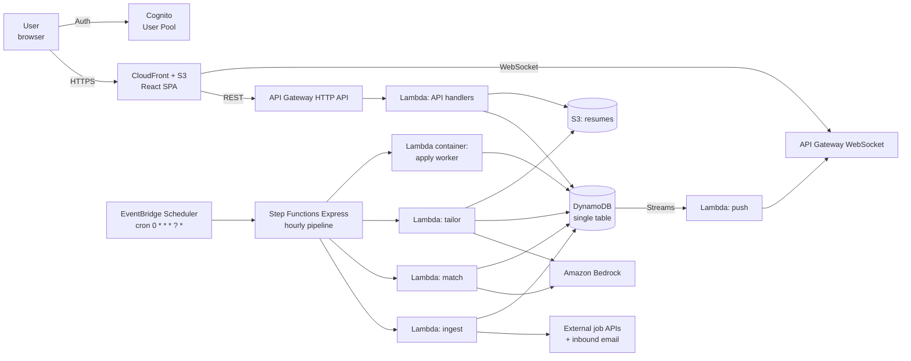
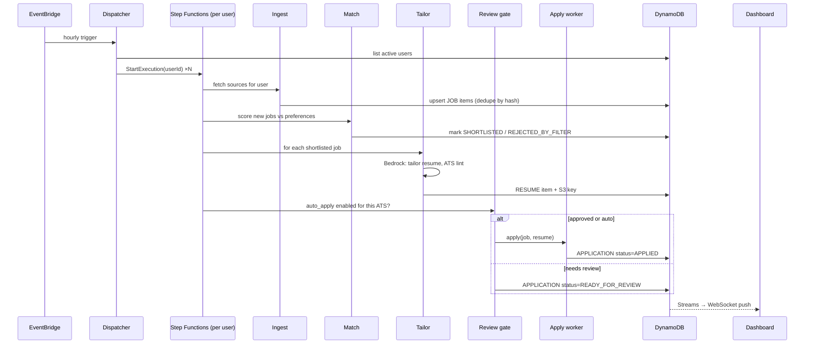
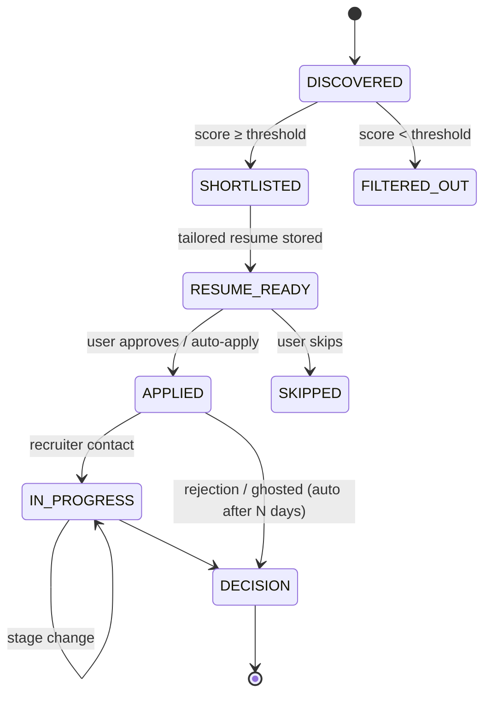

# 01 — Architecture Blueprint

**Project:** (name TBD) — Automated job discovery, resume tailoring and application tracking platform
**Status:** Draft v0.1 — pre-build
**Audience:** Founders / builders (you + your friend), future contributors

---

## 1. What we are building

A multi-tenant, cloud-native platform that, for each registered user, runs an hourly pipeline to:

1. Ingest new job postings (C2C, W2, full-time) from approved sources
2. Score and shortlist them against the user's preferences
3. Generate an ATS-friendly, role-specific version of the user's resume
4. Apply — either automatically (where safe and permitted) or after one-click approval
5. Reflect every state change on a real-time Kanban dashboard

Everything runs on AWS, serverless-first, inside the free tier where possible.

---

## 2. Two design decisions you need to make before anything else

These are not implementation details. They change the shape of the system, so read them before the diagrams.

### 2.1 Where the jobs come from

Not every job board allows automated access. Building on sources that forbid it means the product breaks the day an account gets banned.

| Source | Automated access | Recommendation |
|---|---|---|
| Greenhouse / Lever / Ashby / Workable public job-board APIs | Documented, free, no auth | **Primary.** Thousands of companies. You maintain a per-user "target companies" list and poll their boards. |
| Adzuna API, USAJOBS API, Remotive/RemoteOK APIs | Documented, free tier | **Secondary aggregators** for breadth. |
| Company career-page RSS feeds | Allowed | Supplementary. |
| **C2C requirement emails** (vendor hotlists, recruiter blasts) | Your own inbox — fully allowed | **Best C2C source.** Gmail → SES/SNS → parse with Bedrock → job record. |
| Dice | Partner API only | Apply for partner access; otherwise treat as manual. |
| LinkedIn, Indeed | Scraping prohibited by ToS; aggressive bot detection | **Do not scrape.** Users can paste a URL and the tool will parse it. |

### 2.2 Auto-submit vs. approve-then-submit

Fully automated submission is the riskiest part of the spec:

- Most enterprise ATS (Workday, Taleo, iCIMS, SuccessFactors) use CAPTCHAs, bot detection and ToS clauses against automation. LinkedIn "Easy Apply" automation gets accounts banned.
- Greenhouse and Lever forms are structurally predictable and realistic to automate.
- Recruiters detect and deprioritise spray-and-pray applicants; a wrong auto-submit is worse than no submit.

**Recommended default:** the pipeline does everything up to a "ready to apply" state, then the user approves in one click from the dashboard. Auto-submit is an opt-in, per-ATS-family setting (`auto_apply.greenhouse = true`), never global. This also gives you a clean answer for the compliance question when you onboard other people.

Everything below assumes this "review gate" design.

---

## 3. System context



---

## 4. The hourly pipeline (per user)

Runs at every `:00`. One Step Functions execution per active user, fanned out by a dispatcher Lambda.



**Idempotency rules**
- Job identity = `sha256(source + external_id)` or `sha256(normalised_url)`. Re-ingesting is a no-op.
- A resume is generated once per `(user, job)`; regeneration is a manual action.
- An application can only be submitted once per `(user, job)`; the worker checks a conditional write before acting.

---

## 5. Kanban state machine



Dashboard columns map directly to these states:

| Column | States shown | Key card actions |
|---|---|---|
| Shortlisted | SHORTLISTED, RESUME_READY | View job, view/download tailored resume, Approve, Skip |
| Applied | APPLIED | View resume used, mark "Recruiter reached out" |
| In progress | IN_PROGRESS with `stage` ∈ {HR screen, Round 1, Technical, Final, Offer discussion} | Opens detail page in new tab; stage stepper, notes, interviewer names, next-step date |
| Decision | DECISION with `outcome` ∈ {Offer, Rejected, Withdrawn, Ghosted} | Outcome, compensation notes |

A collapsed "Filtered out" bucket (count only, expandable) satisfies the "how many were shortlisted vs rejected by my filters" requirement.

---

## 6. AWS service map

| Concern | Service | Why this and not something else |
|---|---|---|
| Static hosting | S3 + CloudFront | Free-tier friendly, global CDN, custom domain via ACM cert |
| Auth / multi-tenancy | Cognito User Pool + Hosted UI | Per-user `sub` becomes the DynamoDB partition key; free up to 10k MAU |
| REST API | API Gateway HTTP API + Lambda (Python 3.12) | Cheaper than REST API type; JWT authorizer against Cognito is built-in |
| Real-time | API Gateway WebSocket API + DynamoDB Streams + Lambda | Near-real-time without polling; connection IDs stored in DynamoDB. Alternative: AppSync subscriptions (more managed, GraphQL) |
| Data | DynamoDB, single table, on-demand | 25 GB + 25 WCU/RCU always-free; Streams enabled |
| Files | S3 (versioned bucket) | Resume versions, source resumes, application screenshots; presigned URLs for download |
| Scheduling | EventBridge Scheduler | `cron(0 * * * ? *)`; 14M invocations/month free |
| Orchestration | Step Functions **Express** | Standard workflows bill per state transition and blow past the 4k/month free tier at 24 runs/day × users; Express bills per execution/duration (cents) |
| Ingestion / matching / tailoring | Lambda (Python) | Fits free tier (1M requests, 400k GB-s per month) |
| LLM | Amazon Bedrock — Claude Haiku for tailoring, Titan/Cohere embeddings for matching | Not free-tier; the main variable cost. Haiku keeps it to cents per resume |
| Apply worker | Lambda **container image** with Playwright + Chromium | 15-min limit is enough per application; stays in Lambda free tier. Move to Fargate Spot only if runtime exceeds limits |
| Inbound email (C2C) | Gmail forwarding rule → SES inbound → S3 → Lambda | Or Gmail API polling from the ingest Lambda |
| Secrets | SSM Parameter Store (SecureString) | Free; Secrets Manager costs $0.40/secret/month |
| Observability | CloudWatch Logs + Alarms, X-Ray on Step Functions | Set log retention to 14 days to stay under free tier |
| Cost guardrails | AWS Budgets + billing alarm | Non-negotiable before the first deploy |
| IaC | AWS CDK v2 (Python) | Matches your Python stack; one `cdk deploy` per environment |
| CI/CD | GitHub Actions → OIDC role in AWS (no long-lived keys) | Free for public repos, 2,000 min/month private |

---

## 7. Data model (DynamoDB single table)

Table `app-main`, PK/SK strings, GSI1 for reverse lookups.

| Entity | PK | SK | Notable attributes |
|---|---|---|---|
| User profile | `USER#<sub>` | `PROFILE` | email, tz, plan, active |
| Preferences | `USER#<sub>` | `PREFS` | titles[], keywords[], locations[], work_type{C2C,W2,FT}, rate/salary floor, target_companies[], excluded_companies[], auto_apply{greenhouse:bool,…} |
| Source config | `USER#<sub>` | `SOURCE#<id>` | type, url/board token, enabled, last_polled |
| Job | `USER#<sub>` | `JOB#<job_hash>` | title, company, source, url, ats_family, posted_at, description_s3_key, score, state |
| Resume version | `USER#<sub>` | `RESUME#<job_hash>` | s3_key (docx + pdf), model, prompt_version, ats_score, created_at |
| Application | `USER#<sub>` | `APP#<job_hash>` | state, stage, applied_at, method{auto,manual}, resume_sk, screenshot_s3_key, notes[], next_step_at |
| Activity log | `USER#<sub>` | `EVENT#<ts>#<uuid>` | type, payload — drives the dashboard feed |
| WS connection | `CONN#<connectionId>` | `USER#<sub>` | TTL 2h |

GSI1: `GSI1PK = USER#<sub>#STATE#<state>`, `GSI1SK = updated_at` → column queries for the Kanban board.
Base resumes live in S3 at `s3://<bucket>/users/<sub>/base/`; tailored at `users/<sub>/tailored/<job_hash>/`.

---

## 8. Multi-tenancy & security

- Every table item carries `USER#<sub>`; API Lambdas derive `sub` from the verified Cognito JWT, never from the request body.
- S3 access only via presigned URLs scoped to the caller's prefix.
- Per-user IAM is unnecessary at this stage; enforce tenancy in the data access layer and cover it with tests.
- Apply worker never stores third-party credentials. If a site needs login, the user completes it themselves (out of scope for automation).
- Resume PII stays in S3 with SSE-S3 encryption, bucket public access blocked, lifecycle rule to Glacier after 180 days.

---

## 9. Cost model (indicative, validate in your own account)

**Free tier note (accounts created after July 15, 2025):** the old 12-month free tier is gone. New AWS customers get $100 in credits at sign-up plus up to $100 more for completing onboarding activities, valid 12 months; anyone who has ever had an AWS account does not qualify. If you do qualify, choose the *Paid* plan — the *Free* plan auto-closes the account after 6 months. Always-free services (Lambda, DynamoDB, Cognito, EventBridge, CloudWatch limits) apply to every account.

**Bedrock unit cost:** Claude Haiku 4.5 on Bedrock ≈ $1 / $5 per million input / output tokens. One tailored resume ≈ 4–5k in + ~2k out ≈ **$0.015 on-demand, ~$0.01 with prompt caching**. Sonnet is 2–3× that.

### One-time rollout

| Item | Cash |
|---|---|
| AWS setup, CDK, Cognito, CloudFront, budgets | $0 |
| Domain (optional) | $12–15 / yr |
| GitHub, tooling, job APIs | $0 |
| Dev/test Bedrock spend (~1,000 test generations) | $15–30 |
| AWS credits, if one founder is a new customer | −$100 to −$200 |
| **Total** | **~$30–50, or net zero with credits** |

### Monthly running cost (24 runs/day, ~15 shortlisted jobs/user/day, Haiku + caching)

| Line | 2 users | 5 users | 25 users |
|---|---|---|---|
| Bedrock — resume tailoring | $10–18 | $25–45 | $130–220 |
| Bedrock — embeddings + C2C email parsing | < $1 | ~$1 | ~$5 |
| Lambda, DynamoDB, EventBridge, Cognito, CloudWatch | $0 | $0–1 | $2–5 |
| S3, API Gateway, CloudFront, ECR | $1–2 | $1–3 | $5–10 |
| Step Functions Express | < $1 | < $1 | $1–2 |
| Route 53 (if custom domain) | $0.50 | $0.50 | $0.50 |
| **Total** | **~$12–22** | **~$30–50** | **~$150–250** |

### Levers (cut the Bedrock line 60–80%)

- Tailor only after the user approves a card, not for every shortlisted job (2-user bill → ~$4–8/month).
- Cap shortlisted jobs per user per day (default 10).
- Prompt caching on base resume + system prompt; Bedrock batch mode (50% off) for non-urgent work.
- Reduce schedule to every 2–3 hours overnight.

### Maintenance

Mostly time, not money: expect 2–4 hours/week for ATS adapter breakage, job API changes, Bedrock model-ID deprecations and dependency updates. No AWS support plan needed at this scale.

---

## 10. Environments & repo layout

```
<repo>/
├── docs/                    # these documents + ADRs
├── infra/                   # CDK app (Python)
│   └── stacks/  auth, api, data, pipeline, web, observability
├── services/
│   ├── api/                 # REST handlers
│   ├── ingest/  match/  tailor/  apply/  push/
│   ├── shared/              # models, DynamoDB access layer, logging
│   └── prompts/             # versioned Bedrock prompt templates — lives under
│                             # services/ (not the repo root) so it ships inside
│                             # the Lambda deployment package
├── web/                     # React + Vite + Tailwind SPA
├── tests/
└── .github/workflows/       # ci.yml, deploy-dev.yml, deploy-prod.yml
```

Environments: `dev` (your personal account, deploy on every merge to `main`) and `prod` (same account, separate stack prefix; deploy on tag). Split into two AWS accounts under an Organization later if you take on real users.

---

## 11. Phased delivery

| Phase | Outcome | Rough effort (2 people, evenings/weekends) |
|---|---|---|
| 0 — Foundations | Repo, CDK skeleton, Cognito, empty dashboard deployed on CloudFront, budgets/alarms | 1 week |
| 1 — Tracking board | Manual job entry, Kanban with all columns, real-time push, resume upload | 2 weeks |
| 2 — Ingestion + matching | Greenhouse/Lever/Adzuna sources, C2C email parsing, scoring, hourly schedule | 2 weeks |
| 3 — Resume tailoring | Bedrock prompts, DOCX/PDF rendering, ATS lint, version history | 2 weeks |
| 4 — Apply worker | Greenhouse + Lever adapters, review gate, screenshots, opt-in auto-apply | 3 weeks |
| 5 — Hardening | Multi-user onboarding, rate limits, cost dashboard, post-project docs | 1–2 weeks |

Phase 1 alone already gives you something useful for your own search while the rest is built.
