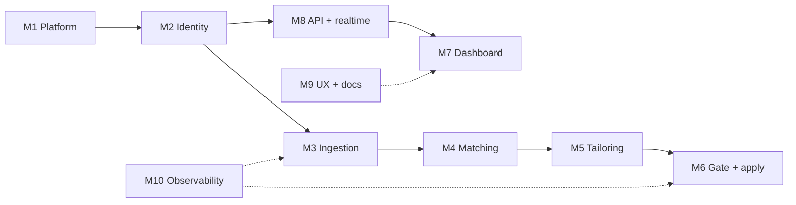

# 02 — Module Breakdown

Each module is independently deployable, has one owner, a clear interface, and its own tests. Suggested split for two people: one owns **Platform + Backend (M1–M5, M8)**, the other owns **Frontend + UX + Docs (M6, M7, M9)**. Swap M4/M5 if the resume/apply logic interests you more.

---

## M1 — Platform & infrastructure

**Purpose:** Everything that has to exist before a line of feature code runs.

| Item | Detail |
|---|---|
| Scope | CDK app, stack per concern, environments, CI/CD, budgets, alarms, log retention, tagging |
| Tech | AWS CDK v2 (Python), GitHub Actions with OIDC federation, `cdk-nag` for policy checks |
| Deliverables | `infra/` app; `cdk deploy --all` produces a working `dev` env from a clean account |
| Definition of done | New contributor can deploy to their own account in < 30 min following `docs/03` |
| Owner | Backend |

Stacks: `AuthStack`, `DataStack`, `ApiStack`, `PipelineStack`, `WebStack`, `ObservabilityStack`.

---

## M2 — Identity & tenancy

**Purpose:** Users sign up, sign in, and only ever see their own data.

| Item | Detail |
|---|---|
| Scope | Cognito user pool, hosted UI or Amplify Auth UI, JWT authorizer on API Gateway, tenancy enforcement in the shared data layer |
| Tech | Cognito, `aws-jwt-verify`, `services/shared/tenancy.py` |
| Interface | Every Lambda receives `user_id` from the authorizer context; never from input |
| Tests | Cross-tenant access attempts must 403; property tests on the data access layer |
| Owner | Backend |

---

## M3 — Ingestion

**Purpose:** Turn the outside world into normalised `JOB` items.

| Item | Detail |
|---|---|
| Scope | Source adapters (plugin pattern), scheduler fan-out, dedupe, description storage, C2C email parser |
| Adapters v1 | `greenhouse`, `lever`, `ashby`, `adzuna`, `usajobs`, `rss`, `email_c2c`, `manual_url` |
| Tech | Python Lambdas, `httpx`, Pydantic models, Bedrock Haiku for email → structured job |
| Interface | `Adapter.fetch(source_config, since) -> list[RawJob]`; `normalise(RawJob) -> Job` |
| Rules | Respect `robots.txt` and published rate limits; back off on 429; adapters are the only place that knows about a source's quirks |
| Tests | Recorded fixtures per adapter; contract test that every adapter emits valid `Job` |
| Owner | Backend |

---

## M4 — Matching & shortlisting

**Purpose:** Decide which of today's jobs are worth the user's time.

| Item | Detail |
|---|---|
| Scope | Hard filters (work type, location, rate floor, excluded companies), semantic score (embedding similarity between job description and user's base resume + stated targets), explainable reasons |
| Tech | Bedrock embeddings (Titan Text v2 or Cohere), cosine similarity in Lambda; no vector DB needed at this scale |
| Interface | `score(job, prefs, profile_embedding) -> {score: float, reasons: [str], hard_fail: str|None}` |
| Output | `JOB.state = SHORTLISTED | FILTERED_OUT`, `JOB.score`, `JOB.reasons[]` shown on the card |
| Tuning | Per-user threshold slider on the dashboard; default 0.72 |
| Owner | Backend |

---

## M5 — Resume tailoring

**Purpose:** One ATS-clean resume per shortlisted job, traceable forever.

| Item | Detail |
|---|---|
| Scope | Prompt templates, structured resume schema (JSON), rewrite step, ATS lint (keywords coverage, section headers, no tables/graphics, fonts), render to DOCX + PDF, version storage |
| Tech | Bedrock Claude Haiku (upgrade to Sonnet for senior roles if needed), `python-docx`, LibreOffice headless in a Lambda layer or `docx2pdf` alternative for PDF |
| Guardrails | Never fabricate experience — prompt is constrained to reorder, rephrase and emphasise facts from the base resume; a "diff view" on the dashboard shows what changed |
| Interface | `tailor(base_resume_json, job) -> TailoredResume{json, docx_key, pdf_key, ats_report}` |
| Storage | S3 `users//tailored/<job_hash>/v<n>.docx|pdf` — always retrievable from the application card |
| Owner | Backend (prompt design can be shared) |

---

## M6 — Review gate & apply worker

**Purpose:** Submit applications safely, or hand them to the user ready-to-go.

| Item | Detail |
|---|---|
| Scope | Decision logic (auto vs review), per-ATS adapters, form filling, file upload, screenshot capture, failure handling, "manual fallback" packet |
| Adapters v1 | `greenhouse`, `lever` (structured forms). Everything else → manual fallback: pre-filled answers + resume link + job URL on the card |
| Tech | Lambda container image with Playwright + Chromium; SQS queue between gate and worker; DLQ for failures |
| Safety | Conditional write on `APP#<job_hash>` prevents double submission; hard cap of N auto-applies per user per day; never attempt CAPTCHAs; never store site credentials |
| Interface | `apply(job, resume, answers) -> {status, screenshot_key, error}` |
| Owner | Backend |

---

## M7 — Dashboard (frontend)

**Purpose:** The Kanban board and everything the user touches.

| Item | Detail |
|---|---|
| Scope | Auth flow, Kanban board, job card, resume viewer/diff, application detail page (new tab), preferences & sources settings, activity feed, cost/usage panel |
| Tech | React 18 + Vite + TypeScript, Tailwind, `@dnd-kit` for drag/drop, TanStack Query for data, native WebSocket client with reconnect, hosted on S3 + CloudFront |
| Real-time | Subscribe on login; server pushes `{type, pk, sk, patch}`; client patches its query cache — no full refetch |
| Routes | `/board`, `/applications/:id` (opens in new tab), `/settings/preferences`, `/settings/sources`, `/settings/automation`, `/resumes` |
| Owner | Frontend |

---

## M8 — Real-time & API

**Purpose:** The contract between backend and frontend.

| Item | Detail |
|---|---|
| Scope | OpenAPI spec (source of truth), REST handlers, WebSocket connect/disconnect/push, DynamoDB Streams consumer |
| Endpoints v1 | `GET /board`, `GET/PATCH /applications/{id}`, `POST /applications/{id}/approve|skip`, `GET /resumes/{id}/download-url`, `GET/PUT /preferences`, `GET/POST/DELETE /sources`, `POST /jobs/manual` |
| Tech | API Gateway HTTP + WebSocket, Lambda (Python, `aws-lambda-powertools`), OpenAPI 3.1 in `docs/api/openapi.yaml`, generated TypeScript client for the frontend |
| Owner | Backend defines, Frontend consumes; spec changes require both to approve the PR |

---

## M9 — UX design & documentation

**Purpose:** Make it usable by people who are not you, and keep the project explainable.

| Item | Detail |
|---|---|
| UX scope | Wireframes for board / card / detail / settings (Figma or Excalidraw), empty states, onboarding flow (upload base resume → set preferences → add sources → first run), mobile layout for the board |
| Docs scope | ADRs (`docs/adr/NNNN-*.md`) for every architectural choice, runbook, onboarding guide, post-project retrospective, API reference (generated from OpenAPI) |
| Standard | Every module README answers: what it does, how to run locally, how to test, how it's deployed |
| Owner | Frontend |

---

## M10 — Observability & operations (cross-cutting)

| Item | Detail |
|---|---|
| Scope | Structured JSON logs with `user_id` + `run_id` correlation, CloudWatch dashboard (runs/hour, jobs ingested, shortlisted, resumes generated, applies, failures, Bedrock spend), alarms on DLQ depth and pipeline failure rate, AWS Budgets at $10 / $25 / $50 |
| Tech | `aws-lambda-powertools` Logger/Metrics/Tracer, CloudWatch, X-Ray |
| Owner | Shared; reviewed weekly |

---

## Dependency order

Work M1 → M2 → M8 → M7 first: it produces a usable manual tracker in Phase 1 and unblocks the frontend owner while the pipeline is built.
